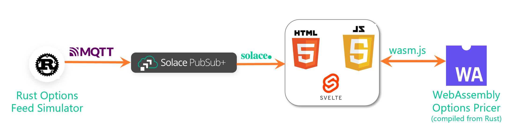

# rust-wasm-js-options-pricer
An options pricer implemented in Rust with a compilation step to WebAssembly via a Svelte Javascript app

There are two components to this app:

  * [black_scholes_option_pricer](black_scholes_option_pricer) - Copied from [ronniec95/black_scholes](https://github.com/ronniec95/black_scholes) and added a few changes to allow it compile down to web-assembly
  * [options_pricing_web_app](options_pricing_web_app) - A svelte app that consumes  option data from Solace and makes web-assembly calls 

## Setup 

Navigate to each of the directories above to look at the setup instruction.

To run an end-to-end application as show in the diagram below, you will need to run a [rust-options-data-simulator](https://github.com/solacese/rust-options-data-simulator)

