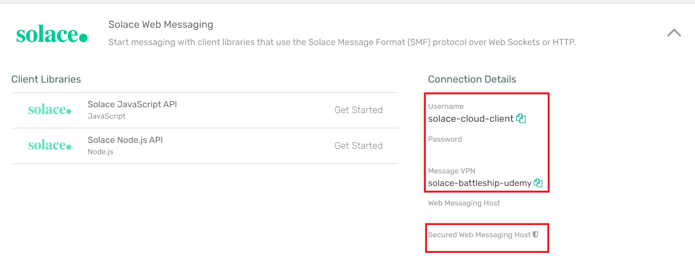
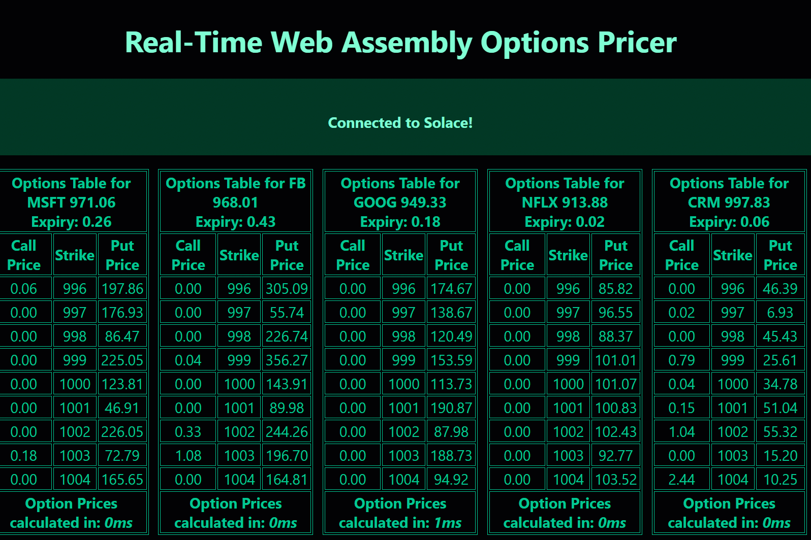

# Options Pricing Web App

This project consumes an options pricing feed from a Solace PubSub+ broker and makes a call to a web-assembly application compiled from Rust to caluclate option prices using the [black-scholes](https://en.wikipedia.org/wiki/Black%E2%80%93Scholes_model) model.

## Requirements

- Install [Node.js](http://nodejs.org)
- Install [Rust](http://www.rust-lang.org)
- Use the following [link](https://docs.solace.com/Solace-Cloud/ggs_signup.htm) as a guide to sign up for a [FREE](https://console.solace.cloud/login/new-account) Solace PubSub+ or setup a [docker container](https://solace.com/products/event-broker/software/getting-started/) locally.
- Setup and run the [rust-options-data-simulator](https://github.com/solacese/rust-options-data-simulator) against the setup Solace PubSub+ instance to simulate an options data feed

## Get started

Install the dependencies...

```
npm install
```

Grab the Solace WebMessaging settings from the Solace Cloud Console as shown below:



and fill them in [src/solace-config.js](src/solace.config.js) or rely on the default settings for a locally installed broker

```
export const solaceConfig = {
SOLACE_HOST_URL: "ws://localhost:8000",
SOLACE_MESSAGE_VPN: "default",
SOLACE_USERNAME: "default",
SOLACE_PASSWORD: "default",
};
```

Run the following command to start the application locally:

```
npm run dev
```

Navigate to [localhost:5000](http://localhost:5000). You should see your app running.

Make sure you start the [rust-options-data-simulator](https://github.com/solacese/rust-options-data-simulator) to start a simulated options feed.

Click the connect button in the app to connect to the Solace broker with the appropriate credentials and you should see a live options table being priced as shown below:


